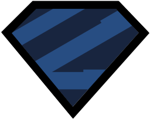
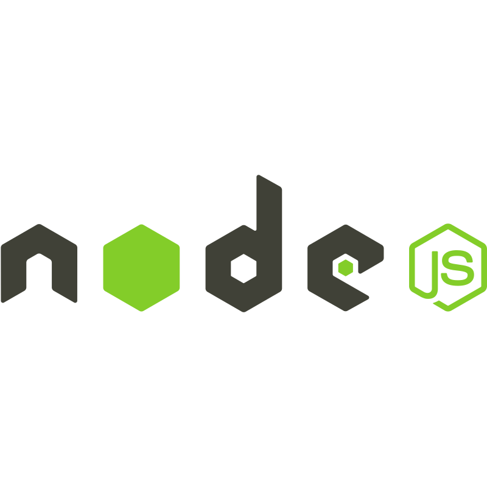

# 👋 Hi, I'm Divyanshu

- 💻 Aspiring Full Stack Developer
- 🚀 Interested in Web Development and AI/ML
- 🌱 Currently learning Node.js and building full-stack applications
- 📫 X (Twitter): https://x.com/usualTechNerd
- 📧 Email: [divyanshuk9515@gmail.com](mailto:divyanshuk9515@gmail.com)

<h1 align="center">🚀 Tech Stack</h1>

<h3 align="center">🎨 Front End</h3>

<table align="center">
  <tr>
    <td align="center" height="70" width="70">
      
       HTML5
    </td>
    <td align="center" height="70" width="70">
      
       CSS3
    </td>
    <td align="center" height="70" width="70">
      
       JavaScript
    </td>
    <td align="center" height="70" width="70">
      
       TypeScript
    </td>
    <td align="center" height="70" width="70">
      
       React
    </td>
  </tr>
  <tr>
    <td align="center" height="70" width="70">
      
       Tailwind CSS
    </td>
  </tr>
</table>

<h3 align="center">🧠 State Management & Data Fetching</h3>

<table align="center">
  <tr>
    <td align="center" height="70" width="70">
      
       Zustand
    </td>
    <td align="center" height="70" width="70">
      
       Redux Toolkit
    </td>
    <td align="center" height="70" width="70">
      
       TanStack Query
    </td>
  </tr>
</table>

<h3 align="center">⚛️ React Ecosystem</h3>

<table align="center">
  <tr>
    <td align="center" height="70" width="70">
      
       React Router
    </td>
    <td align="center" height="70" width="70">
      
       React Hook Form
    </td>
    <td align="center" height="70" width="70">
      
       Zod
    </td>
    <td align="center" height="70" width="70">
      
       Framer Motion
    </td>
  </tr>
</table>

<h3 align="center">🛠️ Tools</h3>

<table align="center">
  <tr>
    <td align="center" height="70" width="70">
      
       Git
    </td>
    <td align="center" height="70" width="70">
      
       Vite
    </td>
  </tr>
</table>

<h3 align="center">🌱 Currently Learning</h3>

<table align="center">
  <tr>
    <td align="center" height="70" width="70">
      
       Node.js
    </td>
  </tr>
</table>

## 🎯 Current Focus

- Building full-stack applications
- Strengthening React and TypeScript skills
- Learning Node.js and backend development
- Preparing for Frontend and Full Stack Developer roles

## 📈 GitHub Stats

  

  

