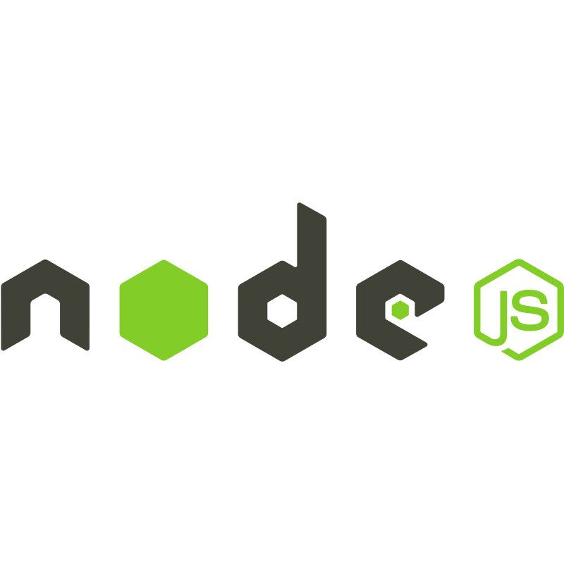
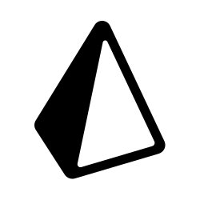
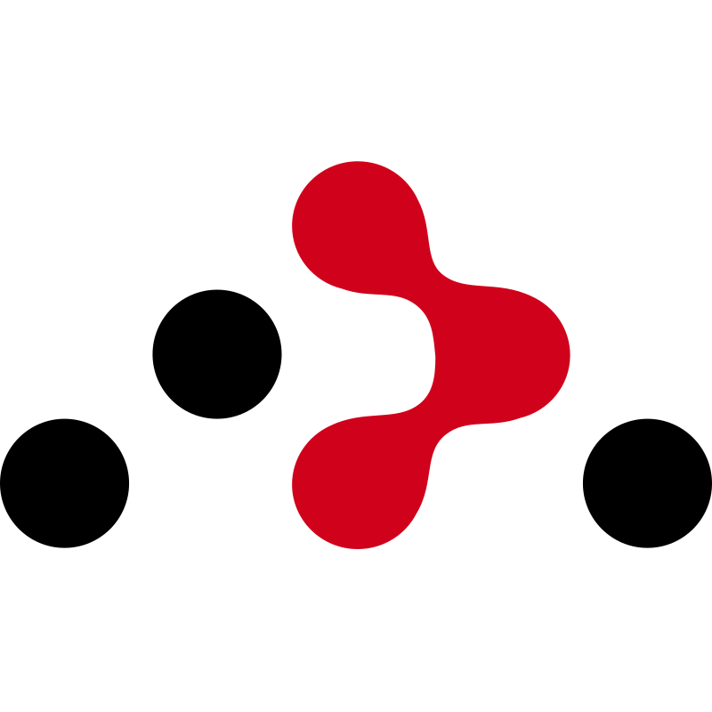
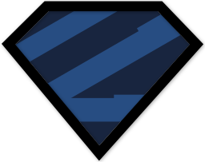

# Hi, I'm Divyanshu 👋

Full Stack Developer building modern web applications with **Next.js, React, TypeScript, and PostgreSQL**.

Currently focused on creating production-ready products, exploring AI integrations, and improving backend architecture skills.

  <a href="https://x.com/usualTechNerd">X (Twitter)</a> •
  <a href="mailto:divyanshuk9515@gmail.com">Email</a>

---

## 🚀 Featured Projects

### 🔗 <a href="https://app.shawty.online/">Shawty</a>

Modern URL Shortener & Analytics Platform.

* Custom short links and aliases
* QR code generation
* Click analytics and tracking
* Responsive dashboard
* Authentication and link management

**Tech Stack:** Next.js, TypeScript, PostgreSQL, Drizzle ORM, Tailwind CSS

**Links:** [Live](https://app.shawty.online/) • [GitHub](https://github.com/Divyanshu951/shawty)

---

### 🎬 <a href="YOUR_MOVIZZ_LIVE_LINK">Movizz</a>

Movie discovery platform with search, trending content, and detailed movie information.

* Trending and popular movies
* Advanced search experience
* Responsive cinematic UI
* Optimized data fetching

**Tech Stack:** React, TypeScript, TanStack Query, Tailwind CSS, Framer Motion

**Links:** Live • GitHub

---

### 🌐 <a href="YOUR_PROJECT_LINK">InApp Clone</a>

URL shortening and link management platform built to strengthen full-stack development skills.

* Link shortening
* Dashboard experience
* Authentication
* Analytics features

**Tech Stack:** React, TypeScript, Node.js

**Links:** Live • GitHub

---

## 🛠 Tech Stack

### Frontend

  
  
  
  
  
  
  

### Backend & Database

  
  
  

### State Management & Libraries

  
  
  
  
  
  
  

### Tools

  
  
  
  

---

## 🎯 Current Focus

* Building production-ready SaaS applications
* Learning scalable backend architecture
* Exploring AI and LLM integrations
* Improving system design fundamentals
* Preparing for Software Engineer roles

---

## 📊 Most Used Languages

  

---

*"Build. Ship. Learn. Repeat."*

